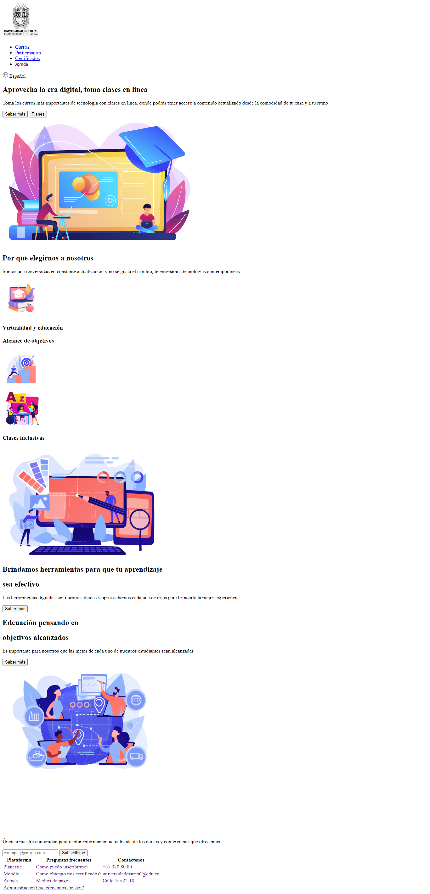

<h1>Taller 9 - Karen Vanessa Villa Santana<h1>

<h2>Información</h2>

Curso: FullStack Básico - Grupo 1

Profesor: Cristian Patiño

<h2>Link de la página Web</h2>

<h2>Punto 1: Link de Figma</h2>
<a href="https://www.figma.com/file/EA9jKtusQIyGawM7yaUcGd/Karen-Vanessa-Villa-Santana?type=design&node-id=5%3A2&mode=design&t=8FNx8HXCGI9oIlkD-1">Link de Figma</a>

<h2>Punto 2: Diseño HTML</h2>

<h2>Punto 3: Diseño CSS</h2>

<h2>Punto 4: Títulos</h2>

<h2>Punto 5: Párrafo</h2>

<h2>Punto 6: Links</h2>

<h2>Punto 7: Navegación</h2>

<h2>Punto 9: Tabla</h2>
